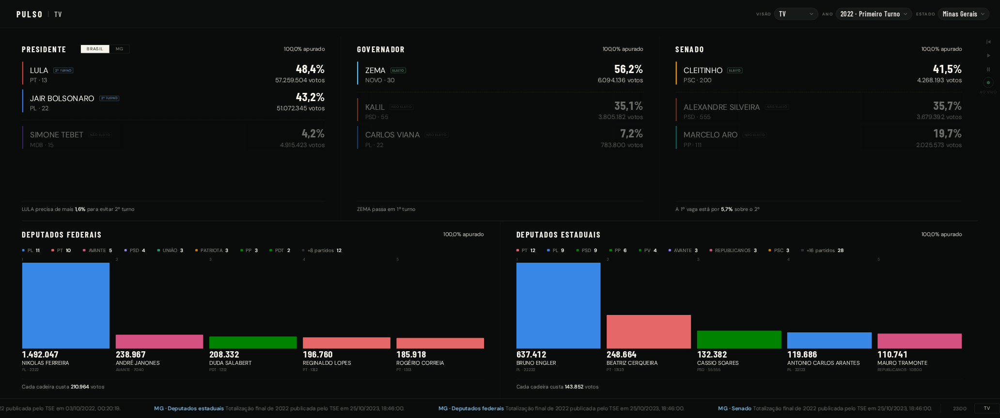
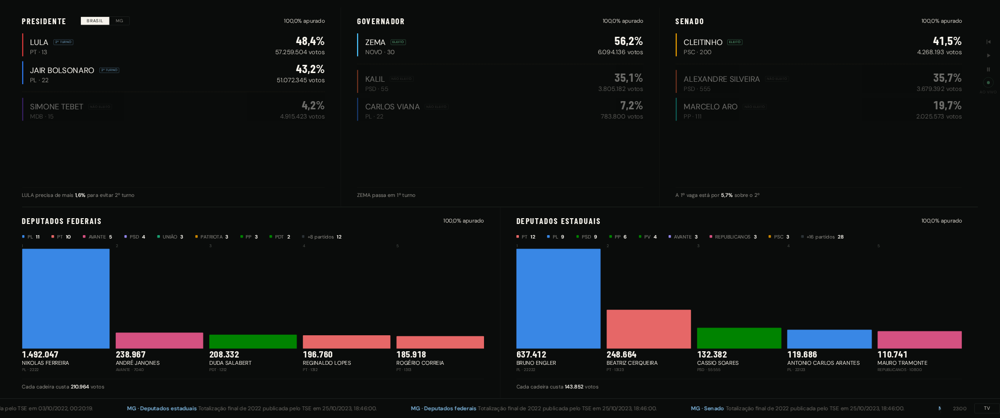
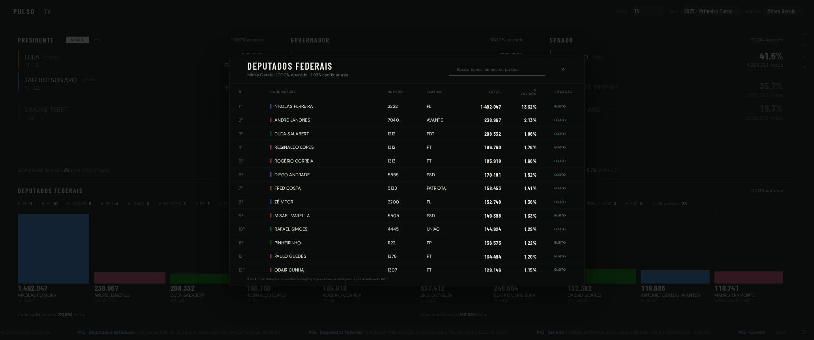
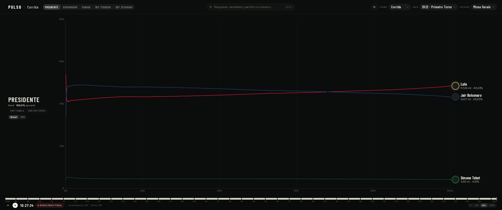
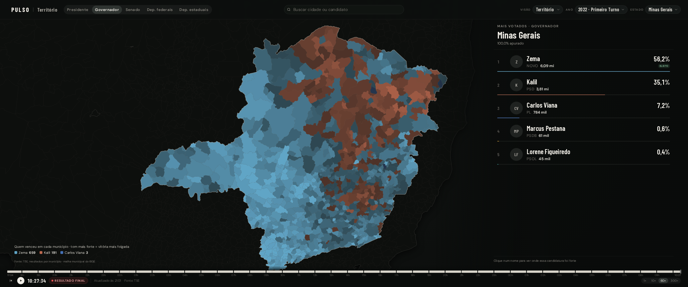

# Pulso Eleitoral

**Acompanhe a eleição de 2026 pelo Pulso** — a apuração do TSE em três telas: **TV**, **Corrida** e
**Território**. Os dados vêm dos arquivos públicos do TSE, chegam segundo a segundo e ficam
gravados no seu disco: dá para voltar a apuração e assistir de novo. Nada aqui é projeção.



## Rodar

Precisa de **Node 22.12+**.

```bash
git clone https://github.com/bruno-baeta/pulso-eleitoral.git
cd pulso-eleitoral
npm install
npm run dev
```

Abra **http://127.0.0.1:5173**. Isso sobe duas coisas: a API em `127.0.0.1:3001` e as telas em `5173`.

> O servidor de desenvolvimento escuta em `0.0.0.0`, de propósito: é o que permite abrir a tela TV
> na televisão da sala pelo IP da máquina. Numa rede que você não controla, troque o script `dev`
> para `vite` sem `--host`. A API já escuta só em `127.0.0.1`.

Para escolher o que ver, use o cabeçalho — ou a URL:

```
http://127.0.0.1:5173/?mode=historico&uf=MG&turn=1
```

| parâmetro | valores |
|---|---|
| `mode` | `historico` (resultado final de 2022), `simulado` (testes do TSE), `official` (eleição de 2026) |
| `uf` | sigla do estado (`MG`, `SP`, …) |
| `turn` | `1` ou `2` |

Sem parâmetro nenhum, abre em 2022 — e, nas noites de 4 e 25 de outubro de 2026, na apuração que
está acontecendo.

### Na primeira vez que rodar

**O repositório não vem com resultado nenhum.** Nada de apuração antiga, nada de simulação: a pasta
`data/` não é versionada. O que vem junto é só a malha de municípios do IBGE (1,1 MB), que é
geografia, e as imagens deste README.

Então, na primeira execução, as telas ficam alguns segundos vazias enquanto o coletor busca os
arquivos de 2022 no TSE — e o mapa do Território leva mais, porque são centenas de arquivos, um por
município. A partir daí tudo fica gravado em `data/` e a abertura é imediata.

> O TSE limita 100 requisições por segundo por IP e bloqueia quem passa disso. Se as telas ficarem
> presas em "Carregando os arquivos de 2022", teste `curl -I https://resultados.tse.jus.br/` — um
> 403 ou um timeout é bloqueio de IP, e ele costuma expirar em algumas horas.

Produção:

```bash
npm run build     # typecheck + bundle + brotli/gzip
npm start         # serve a API e as telas já construídas
```

## As telas

### TV — as cinco disputas de uma vez

Presidente, governador e senado como lista de quem está na frente; deputados federais e estaduais
como bancadas e os mais votados. O rodapé passa o fio da noite: viradas, eleitos, marcos de
apuração. O botão **TV** joga na tela cheia, sem a barra do aplicativo.



Clicar no título de uma disputa abre a tabela inteira, com busca; clicar num nome abre as cidades
onde aquela candidatura foi votada.



Na lateral direita fica o player: início, tocar, pausar, a velocidade (1×, 60×, 100×) e o ao vivo.
Ele reproduz a apuração gravada no disco, minuto a minuto.

### Corrida — como cada disputa chegou até aqui



### Território — onde cada candidatura ganhou



## Como os dados chegam

- O coletor lê os arquivos do TSE e guarda cada atualização aceita em `data/recordings/`
  (um NDJSON por disputa e sessão). É isso que o player reproduz.
- Nas janelas do TSE — os testes de setembro e as noites de 4 e 25 de outubro de 2026 — ele coleta
  e grava **os 27 estados** sozinho, mesmo sem navegador aberto. O que não for buscado na hora não
  se recupera depois: a apuração já passou.
- O TSE permite **100 requisições por segundo por IP**, e o código trava nesse teto. A conta de uma
  noite de eleição, com os 27 estados sendo gravados e o mapa municipal varrendo o país:

  | de onde vem | req/s |
  |---|---|
  | 26 estados gravados (5 cargos a cada 15 s) | 8,7 |
  | o estado que está na tela (5 cargos a cada 1 s) | 5,0 |
  | arquivo de andamento | 0,2 |
  | municípios, em fila de baixa prioridade | 60,0 |
  | **total** | **73,9 de 100** |

  A fila municipal só usa a folga deixada pelas disputas, e um 404 dela — município que ainda não
  publicou — não pausa a coleta. Rodar duas instâncias atrás do mesmo IP dobra a conta.

- `GET /api/diagnostico` responde, com número, qual foi o **pico de requisições por segundo** desde
  que o processo subiu, o teto configurado e se o TSE pausou as consultas. É por onde se descobre,
  numa noite de apuração, se a tela parou de encher por culpa nossa ou deles.
- Fora das janelas, o simulado não é consultado: a tela abre a última sessão gravada, em replay.

Configuração opcional em `.env` — veja `.env.example`.

## Desenvolvimento

```bash
npm test           # 160 testes das contas: ranking, bancadas, formatação, rotas, coleta do TSE
npm run test:telas # 29 verificações nas três telas, num navegador (precisa do npm run dev no ar)
npm run typecheck  # tsc --noEmit
npm run baseline   # grava a referência de pixels; -- check compara com ela
```

Os testes de conta não precisam de rede nem de navegador. Os de tela sobem um Chromium contra o
servidor de desenvolvimento e conferem o que só aparece carregando a página — a tabela buscando as
1.035 candidaturas, o player voltando ao vivo, a troca de estado, a bancada somando as 53 vagas.

Estrutura:

```
src/lenses/tv/         a tela TV (main, estilo, player de replay)
src/lenses/corrida/    a tela Corrida (as curvas no tempo)
src/lenses/territorio/ o mapa municipal
src/shell/             o que as três compartilham: cabeçalho, player, tabela e dados
src/domain/            ranking, situação do candidato, vagas, formatação
server/                coletor do TSE, gravação, replay e a API
shared/                o contrato entre os dois lados
```

## Licença

MIT.
